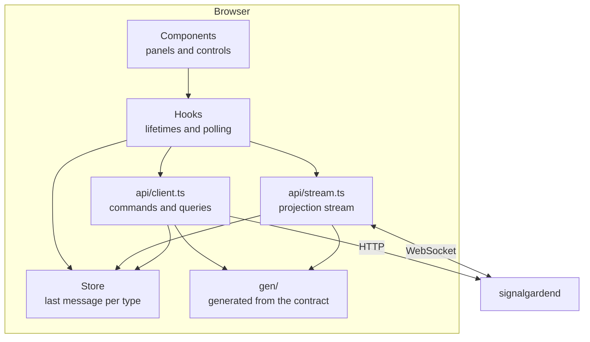

# Client Architecture

## Layers

| Layer            | Responsibility                                                  | What it must not do             |
| ---------------- | --------------------------------------------------------------- | ------------------------------- |
| `src/gen`        | The contract, generated                                         | Be edited                       |
| `src/api`        | Both transports, the 64-bit edge, status mapping                | Hold state, or know about React |
| `src/state`      | The last message of each type, plus unacknowledged local intent | Derive a garden                 |
| `src/hooks`      | Lifetimes: one stream per run, one poll per run                 | Render                          |
| `src/components` | Render what the store holds                                     | Call `fetch`                    |

## Rules

- **The daemon is the authority for garden state.** The processor decides what a garden is. This
  client renders projections and never calculates an authoritative outcome, so when a snapshot and
  a local guess disagree, the snapshot wins — the alternative is an interface that quietly diverges
  from the system it claims to be showing.

- **The projection stream is read-only.** Commands go over the generated REST routes. That boundary
  is the daemon's; reproducing half of it here would make the browser the second place someone has
  to look to find out how a run is steered.

- **No frame, no garden.** Nothing is interpolated, smoothed, or predicted between frames. A run at
  a 2-second tick interval looks like a run at a 2-second tick interval.

- **Local intent is separate from acknowledged state.** A control the person is dragging lives in
  `draft` until the daemon issues a revision. It is cleared on acceptance rather than on send,
  because until the receipt arrives the change is a wish rather than a fact.

- **One place converts.** 64-bit values are `bigint` from the parse until the render. Converting
  early is how a comparison ends up between a `number` and a `bigint` and is silently wrong.

- **Failures are branched on by status.** The daemon maps every condition to a status code rather
  than to message text, and `src/api/errors.ts` turns those into a discriminated reason. No
  component ever matches on a string.

## Two Kinds Of Freshness

There are two different "how current is this", and conflating them is the mistake this client is
built to avoid:

- `sequence` orders frames **within a connection**. A run emits none while nobody is watching, so a
  sequence number says nothing about the history behind it.
- `folded_offset` names **the history behind one frame**. It is what a reconnect resumes from.

The connection banner shows both, labelled differently, for that reason.

## Where State Lives

Nothing is persisted in the browser. A reload is a new client: it attaches to a run by ID and the
daemon serves it the garden as it stands. Run history is the daemon's, on disk, and a run outlives
the process that was serving it — which is why the client has an "attach to a run" path at all,
and not only a "start one" path.
